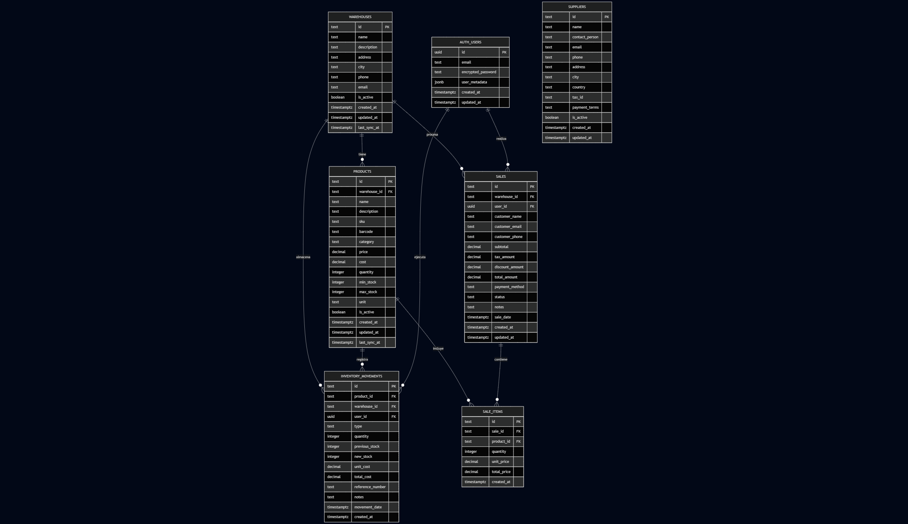
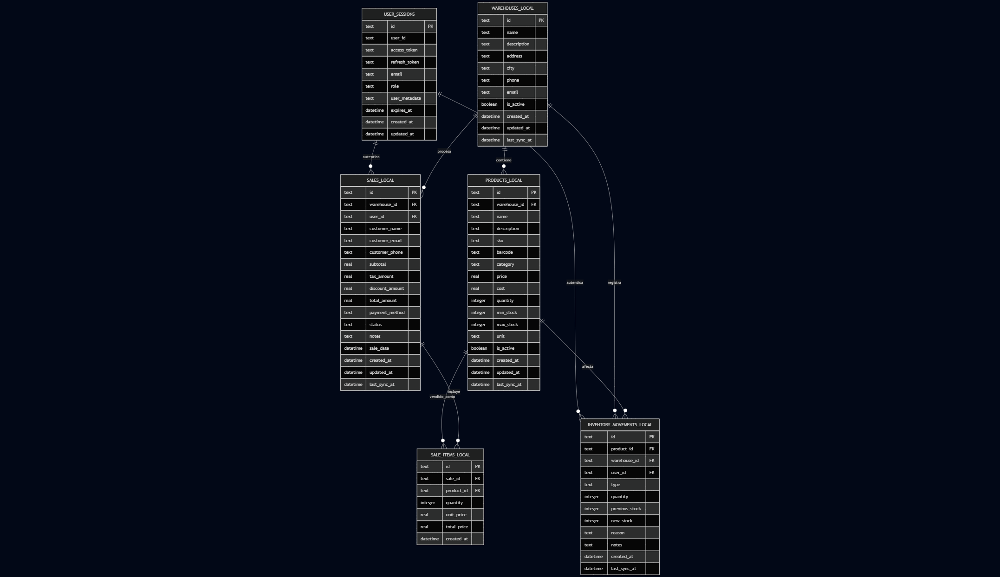

# Sistema de Gestión de Almacenes
## Proyecto Final - Programación Móvil Avanzado - Paralelo 1

### Autor: Jorge Carlos Chavez Ruiz
### Fecha: Octubre 2025

---

## 1. Descripción del Proyecto y Funcionalidad

El Sistema de Gestión de Almacenes es una aplicación móvil integral desarrollada para la administración completa de inventarios y operaciones comerciales.

### Funcionalidades Principales

**Sistema de Autenticación y Autorización:**
- Registro e inicio de sesión seguro con email y contraseña
- Sistema de roles diferenciado (usuario regular y administrador)
- Gestión de sesiones persistentes con JWT tokens
- Recuperación de contraseñas mediante email

**Gestión de Almacenes:**
- Creación y administración de múltiples almacenes
- Información detallada de cada almacén (dirección, contacto, estado)
- Control de acceso basado en roles

**Control de Inventarios:**
- CRUD completo de productos con información detallada
- Control de stock en tiempo real
- Alertas de productos con stock bajo
- Categorización de productos con códigos SKU
- Movimientos de inventario con trazabilidad completa

**Sistema de Ventas:**
- Registro de ventas con múltiples productos
- Diferentes métodos de pago
- Cálculo automático de totales e impuestos
- Historial completo de transacciones por usuario

**Módulo de Reportes:**
- Reportes de ventas por períodos específicos
- Estadísticas de productos más vendidos
- Reportes administrativos consolidados (solo administradores)
- Generación de documentos PDF con gráficos y análisis

**Gestión de Usuarios (Solo Administradores):**
- Lista completa de usuarios registrados
- Información de acceso y roles de cada usuario
- Control de estados de cuenta

**Funcionalidad Offline-First:**
- Operación completa sin conexión a internet
- Sincronización automática cuando se restablece la conexión

---

## 2. Tecnologías Utilizadas y Arquitectura

### Stack Tecnológico

**Frontend (Flutter 3.9.2+):**
- **Dart**: Lenguaje de programación principal
- **Material Design 3**: Sistema de diseño moderno y consistente
- **Flutter BLoC 8.1.4**: Gestión de estado reactiva y escalable
- **Flutter Localizations**: Soporte de localización en español
- **PDF Generation**: Generación de reportes en formato PDF
- **Permission Handler**: Gestión de permisos del sistema

**Backend (Supabase):**
- **PostgreSQL**: Base de datos relacional robusta
- **Row Level Security (RLS)**: Seguridad granular a nivel de registro
- **Real-time Subscriptions**: Actualizaciones en tiempo real
- **Supabase Auth**: Sistema de autenticación JWT
- **Edge Functions**: Funciones serverless para lógica compleja

**Persistencia Local (Drift):**
- **SQLite**: Base de datos embebida para cache local
- **Type-safe Queries**: Consultas SQL con verificación de tipos
- **Automatic Migrations**: Sistema de migraciones de esquema
- **DAO Pattern**: Objetos de acceso a datos optimizados

### Arquitectura del Sistema

**Patrón BLoC (Business Logic Component):**
- Separación clara entre UI, lógica de negocio y datos
- Estados reactivos basados en Streams
- Gestión predictible del estado de la aplicación
- Alta testabilidad y mantenibilidad

**Repository Pattern:**
- Abstracción completa de fuentes de datos
- Intercambio transparente entre Supabase y Drift
- Implementación de cache inteligente
- Flexibilidad para cambios futuros de backend

**DAO Pattern (Data Access Object):**
- Encapsulación de operaciones de base de datos
- Consultas SQL optimizadas y reutilizables
- Separación de responsabilidades de acceso a datos

**Flujo de Datos:**
```
UI Event → BLoC Event → Repository → Supabase/Drift → Data Response → BLoC State → UI Update
```

**Estructura Modular:**
```
lib/
├── blocs/          # Gestión de estado (8 BLoCs especializados)
├── repositories/   # Capa de abstracción de datos
├── models/         # Modelos de datos tipados
├── screens/        # Interfaz de usuario modular
├── services/       # Servicios externos (Supabase, PDF)
├── database/       # Configuración de Drift y DAOs
└── config/         # Configuraciones de la aplicación
```

---

## 3. Descripción de las Bases de Datos

### Base de Datos Principal - Supabase (PostgreSQL)



La base de datos principal en Supabase implementa un esquema relacional robusto con las siguientes características:

**Tablas Principales:**
- **auth.users**: Gestión de usuarios con metadatos de roles
- **warehouses**: Información de almacenes con datos de contacto
- **products**: Catálogo de productos con control de stock
- **inventory_movements**: Trazabilidad completa de movimientos de inventario (funcionalidad no implementada)
- **sales**: Registro de transacciones de venta
- **sale_items**: Detalle de productos por venta
- **suppliers**: Información de proveedores (funcionalidad no implementada)

**Características de Seguridad:**
- **Row Level Security (RLS)**: Políticas granulares de acceso por usuario
- **Roles diferenciados**: Administradores con acceso completo, usuarios con acceso restringido a sus datos
- **Funciones RPC**: Operaciones complejas ejecutadas en el servidor
- **Triggers automáticos**: Actualización de stock y auditoría de cambios

**Integridad Referencial:**
- Claves foráneas entre todas las entidades relacionadas
- Constraints de validación de datos críticos
- Índices optimizados para consultas frecuentes

### Base de Datos Local - Drift (SQLite)



La base de datos local implementa un subset optimizado del esquema principal para operación offline:

**Tablas de Cache:**
- **warehouses_cache**: Almacenes accesibles para el usuario actual
- **products_cache**: Productos con stock actualizado
- **sales_cache**: Ventas realizadas offline pendientes de sincronización
- **user_sessions**: Gestión de sesiones locales
- **sync_status**: Control de estado de sincronización

**Características Técnicas:**
- **Type-safe Queries**: Consultas verificadas en tiempo de compilación
- **Migrations Automáticas**: Evolución controlada del esquema local
- **Optimización de Performance**: Índices específicos para consultas offline
- **Compresión de Datos**: Almacenamiento eficiente en dispositivos móviles

**Estrategia de Sincronización:**
- **Write-Through**: Escrituras prioritarias en Supabase con cache local
- **Read-First**: Lecturas desde cache local con fallback a Supabase
- **Conflict Resolution**: Supabase como fuente de verdad para resolver conflictos
- **Background Sync**: Sincronización automática en segundo plano